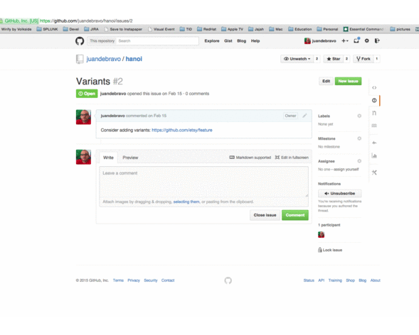

## Clickable Words

A plugin for [Sublime Text 2 and 3](http://sublimetext.com) to ease opening a web link from a keyword in the open document.

Heavily inspired in [Clickable URLs](https://www.github.com/leonid-shevtsov/ClickableUrls_SublimeText2), it enables a simple way to open an URL from Sublime Text editor. Instead of requiring the *entire URL* to be present in the document, it lets you *configure a list of regular expressions to be used as URL matchers*. Upon the cursor being over a text that matches a configured regular expression, the associated URL will be interpolated with the captured values and open in the default/configured browser.

It can be used via a keystroke (`Cmd+Option+Enter` by default) or using the Command Palette menu (`Click and open URL`).

As [Clickable URLs](https://www.github.com/leonid-shevtsov/ClickableUrls_SublimeText2), it exposes as well a command to open every URL that is matched against the open document (`Click and open all URLs in the file`).




# Performance

This plugin does not work upon updating/storing the file, only when the command is executed (via command palette or keystroke).

## Installation

Look for **Clickable Words** with [Package Control](http://wbond.net/sublime_packages/package_control), or just drop the plugin into Sublime Text's Packages folder.

## Configuration

Create a ClickableWords.sublime-settings file or include plugin settings prefixed with clickablewords. in your preferences or project files.

#### Words to be matched

You can configure a list of regexpr to be matched.

```
{
    "URLS": [
        {
            "regexpr": "reg-expr1",
            "url": "url-1-with-proper-group-expansion"
        },
        {
            "regexpr": "reg-expr2",
            "url": "url-2-with-proper-group-expansion"
        }
    ]
}

```

Example to create links to issues in a github repository:

```
{
    "URLS": [
        {
            "regexpr": "\\b(?:([\\w-]+)/)?([\\w-]+)#(\\d+)\\b",
            "url": "https://github.com/{0}/{1}/issues/{2}"
        }
    ]
}

```

For instance, *juandebravo/hanoi#2* will be linked to *https://github.com/juandebravo/hanoi/issues/2*.

#### Customising the browser

```
    {
        "clickable_urls_browser": null
    }
```

Check [webbrowser library](https://docs.python.org/2/library/webbrowser.html#webbrowser.register) for the supported configuration values.

# Credits

- [Juan de Bravo](https://github.com/juandebravo)

Thanks to [Leonid Shevtsov](http://leonid.shevtsov.me) for [Clickable URLs](https://www.github.com/leonid-shevtsov/ClickableUrls_SublimeText2) and [Iván -DrSlump- Montes](https://github.com/drslump) for the idea.
